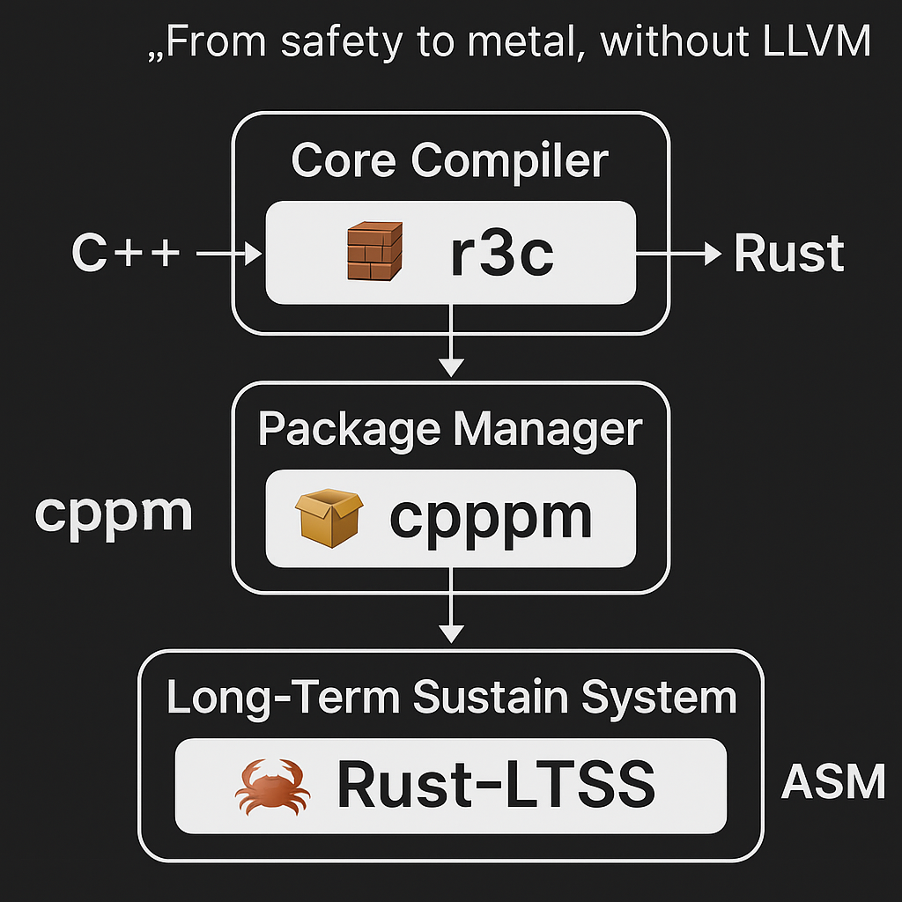

# 🪶 R3C Ecosystem  
> “Modern compilers must learn to breathe without LLVM.”  
> From safety to metal — the post-LLVM compiler lineage.

---

## 🧭 Overview
**R3C Ecosystem** connects the toolchains built under one philosophy:  
**C++ → Rust → ASM**, unified into an **LLVM-free, self-sustaining compiler pipeline.**

This project defines a new industrial compiler model —  
from legacy to safety, from safety to metal.  
It’s not a replacement, but an evolution of C and Rust into a transparent ecosystem.

📊 **View Ecosystem Diagram →**  

---

## 🧩 Ecosystem Structure
| Layer | Repository | Role | Status |
|--------|-------------|------|--------|
| 🧱 Core Compiler | [r3c](https://github.com/0200134/r3c) | Self-hosting C++ ↔ Rust transpiler | 🔥 Active |
| 📦 Package Manager | [cpppm](https://github.com/0200134/cpppm) | C++ Package Manager for modular builds | 🧱 Stable |
| 🌙 Nightly LTSS | [R3C-nightly-ltss](https://github.com/0200134/R3C-nightly-ltss) | Rust→ASM nightly testing channel | 🧪 Experimental |
| 🪶 Ecosystem | (This repo) | Documentation hub & roadmap | 🧭 Hub |

---

## ⚙️ Philosophy
> “Modern compilers must learn to breathe without LLVM.”

C++ — heritage of power  
Rust — bridge of safety  
ASM — metal of truth  

R3C Ecosystem redefines *compilation* as a continuum,  
where languages cooperate instead of compete.  
It’s not about replacement — it’s about rebirth.

---

## 🧾 Goals
- Establish an independent build pipeline for C++, Rust, and ASM  
- Design an open ABI layer between Rust and C++ (LLVM-independent)  
- Support industrial LTSS (Long-Term Sustain System)  
- Serve as a research base for future LLVM-independent compilers  

---

## 🔗 Related Projects
| Repo | Description |
|------|--------------|
| 🧱 [R3C (Core)](https://github.com/0200134/r3c) | Main compiler: C++ ↔ Rust transpiler |
| 📦 [cpppm](https://github.com/0200134/cpppm) | C++ package and build manager |
| 🌙 [R3C-nightly-ltss](https://github.com/0200134/R3C-nightly-ltss) | Nightly LTSS experimental branch |
| 🦀 [Rust-LTSS](https://github.com/0200134/Rust-ltss) | Long-term Rust sustain system (starts 2028) |
| 🪶 [R3C-ecosystem](https://github.com/0200134/R3C-ecosystem) | Central documentation & roadmap |

---

## 🧪 Branches
| Branch | Purpose |
|---------|----------|
| main | Ecosystem documentation & index |
| r3c-core | Core compiler integration |
| cpppm | Packaging & dependency layer |
| ltss | Rust-to-ASM nightly testing |

---

## 📅 Project Timeline
| Year | Phase | Description |
|------|--------|-------------|
| 2025 | Documentation & Stabilization | Core compiler maturity, ecosystem docs |
| 2026 | Integration | R3C ↔ cpppm connection & pipeline testing |
| 2027 | Nightly Expansion | R3C-nightly-LTSS experimental branch |
| 2028 | 🚀 Implementation Phase | Start of Rust-LTSS & Embedded LTSS projects |
| 2029+ | Industrial Phase | Cross-platform LTSS deployment and research |

---

## 🤝 Collaboration
Contributions and collaborations are welcome — especially from:

- Compiler engineers and language designers  
- Embedded and systems developers  
- Industrial toolchain researchers  

Open an issue with `[DISCUSSION]` and label it **collaboration**.

---

## 🧠 Join the R3C Idea Pool
> “Ideas are the seeds of compilers.”

Got a vision for the post-LLVM future?  
Want to share a concept about **Rust-LTSS**, **C++↔Rust bridges**, or **assembly backends**?  

💡 Contribute your ideas, designs, or research thoughts in our official discussion space:  
👉 [**R3C Idea Pool — 아이디어 수집소**](https://github.com/0200134/R3C-ecosystem/discussions)

You can:
- Post new proposals (`architecture`, `ltss`, `rust`, `c++`, `asm`, etc.)
- Discuss compiler design philosophy
- Help shape the future of the LLVM-free ecosystem

🪶 **R3C Ecosystem — where ideas evolve into compilers.**

---

## 📜 License
**MIT License**  
Free for industrial research, education, and open collaboration.

📧 Contact: **0200134hjh@gmail.com**

---

🪶 **R3C Ecosystem — “From safety to metal, without LLVM.”**  
> Languages evolve. Compilers age.  
> But philosophy — endures.
